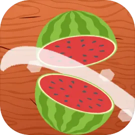

# Клон Fruit Ninja - Unity 3D



Это клон игры Fruit Ninja, созданный с использованием Unity. В этой игре игрок разрезает фрукты, управляя движением ножа. Игра имеет простую механику, но захватывающий процесс срезания фруктов.

## Особенности

- **Простой 3D игровой процесс**: Игрок управляет ножом, разрезая фрукты, смахивая по экрану или кликая мышью.
- **Система разрезания фруктов**: Когда нож пересекает фрукт, тот разрезается на части, которые разлетаются.
- **Бомбы**: Разрезание бомбы приведет к завершению игры.
- **Система спавна фруктов**: Фрукты генерируются случайным образом с помощью скрипта **Spawner**.
- **Очки**: Игрок зарабатывает очки за каждый разрезанный фрукт, которые отображаются в UI.

## Ход игры
1. **Экран начала игры**: Игра начинается автоматически, когда спавнятся фрукты.
2. **Игровой процесс**: Смахивайте по экрану или кликайте, чтобы разрезать фрукты.
3. **Конец игры**: Игра закончится, если будет разрезана бомба.

## Демо

Вот как выглядит игра в процессе:


## Используемые технологии
- **Unity**: Игровой движок для создания игры.
- **C#**: Язык программирования для логики игры.
- **Анимация на основе спрайтов**: Для движения фруктов и их разрезания.
- **Физика**: Реализация разлетающих фруктов с физическим поведением.

## Как запустить

### Требования
1. **Unity**: Этот проект создан в Unity. Вы можете скачать Unity Hub [здесь](https://unity.com/).
2. **Git**: Убедитесь, что у вас установлен Git для клонирования репозитория. Скачать Git можно [здесь](https://git-scm.com/).

### Установка

1. Клонируйте репозиторий:
    ```bash
    git clone https://github.com/Olegus26/FruitNinja.git
    ```

2. Откройте проект в Unity:
    - Запустите Unity Hub.
    - Нажмите "Open" и выберите папку с клонированным проектом.
    - Откройте проект.

3. Нажмите кнопку "Play" в Unity, чтобы начать игру и увидеть её в действии!

## Управление в игре
- **Смахивание по экрану** или **Клик мышью**: Разрежьте фрукты, проходящие через экран.

## Обзор кода
Игра состоит из следующих ключевых компонентов:

- **GameManager**: Контролирует общий ход игры, включая логику игры (например, начало, конец игры и перезапуск).
- **Blade**: Обрабатывает срезание фруктов, включая взаимодействие с фруктами и анимацию ножа.
- **Fruit**: Логика появления фруктов, их разрезание и анимация.
- **Bomb**: Бомбы, которые разрушаются, если их разрезать, что заканчивает игру.
- **Spawner**: Спавнит фрукты в случайных позициях с определённой периодичностью, создавая динамичное поле для игры.

## Вклад в проект
Не стесняйтесь форкать этот репозиторий, вносить изменения и создавать pull request, если у вас есть улучшения или исправления!

## Лицензия
Этот проект с открытым исходом, доступен под лицензией MIT.

## Контакты
Если у вас есть вопросы или предложения, не стесняйтесь связаться со мной:
- Электронная почта: olegomelchenko26@gmail.com
- GitHub: [Olegus26](https://github.com/Olegus26)
